# Lab 09a - Implement Web Apps


## Índice

1. [Descripción del laboratorio](#descripción-del-laboratorio)
2. [Escenario del laboratorio](#escenario-del-laboratorio)
3. [Esquema Visual del Laboratorio](#esquema-visual-del-laboratorio)
4. [Habilidades adquiridas](#habilidades-adquiridas)
5. [Costo Total del Laboratorio](#costo-total-del-laboratorio)
6. [Desarrollo del laboratorio](#desarrollo-del-laboratorio)
   - [Tarea 1: Crear y configurar un Azure Web App](#tarea-1-crear-y-configurar-una-azure-web-app)
   - [Tarea 2: Crear y configurar un deployment slot](#tarea-2-crear-y-configurar-un-deployment-slot)
   - [Tarea 3: Configurar Web App deployment settings](#tarea-3-configurar-web-app-deployment-settings)
   - [Tarea 4: Swap deployment slots](#tarea-4-swap-deployment-slots)
   - [Tarea 5: Configurar y probar autoscaling](#tarea-5-configurar-y-probar-autoscaling)
7. [Conceptos reforzados](#conceptos-reforzados)
8. [Resultados esperados](#resultados-esperados)
9. [Limpieza de recursos](#limpieza-de-recursos)
10. [Contribuciones](#contribuciones)
11. [Licencia](#licencia)

---

## Descripción del laboratorio

En este laboratorio aprenderemos a trabajar con **Azure Web Apps**, un servicio de **Plataforma como Servicio (PaaS)** que permite hospedar aplicaciones web, móviles y APIs sin necesidad de administrar infraestructura física.  

Durante el desarrollo del ejercicio se configurará una aplicación web en Azure para mostrar un mensaje *Hello World* proveniente de un repositorio externo en **GitHub**. Además, se explorará cómo crear un **staging slot** para pruebas previas al despliegue en producción y cómo realizar un **swap** entre ambos entornos, garantizando que el código probado se publique de manera segura.  

Otro aspecto clave es la configuración de **autoscaling**, que permite que la aplicación se ajuste automáticamente a la demanda de usuarios, asegurando un rendimiento óptimo sin intervención manual.

En conjunto, este laboratorio proporciona una experiencia práctica sobre cómo migrar aplicaciones web hacia la nube, aprovechar la flexibilidad de los slots de despliegue y garantizar la escalabilidad automática frente a variaciones en la carga de trabajo.

---

## Escenario del laboratorio

La organización desea migrar sus sitios web desde un centro de datos local hacia **Azure Web Apps**. Actualmente los sitios corren en servidores Windows con PHP, pero el hardware está llegando al fin de su vida útil. La meta es evitar costos de nuevo hardware utilizando Azure como plataforma de hospedaje.

---

## Esquema Visual del Laboratorio

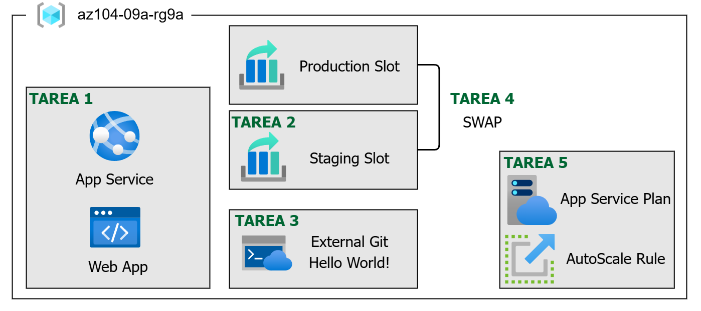

## Tareas del laboratorio

- **Tarea 1:** Crear y configurar una aplicación web en Azure.  
- **Tarea 2:** Crear y configurar un *deployment slot*.  
- **Tarea 3:** Configurar los ajustes de despliegue de la aplicación web.  
- **Tarea 4:** Realizar el intercambio (*swap*) de los *deployment slots*.  
- **Tarea 5:** Configurar y probar el escalado automático

---

## Habilidades adquiridas

- Creación y configuración de **Azure Web Apps**.  
- Configuración de *deployment slots* (staging y producción).  
- Integración de aplicaciones con repositorios externos (GitHub).  
- Swap de slots para mover código probado a producción.  
- Configuración y prueba de autoscaling en App Services.

---

## Costo Total del Laboratorio

El costo principal de este laboratorio proviene del **App Service Plan Premium V3 P1V3** en la región **Central US**.  
Según la calculadora de precios de Azure (abril 2026):

- **App Service Plan Premium V3 P1V3**  
  - Precio estimado: **$124.10 USD/mes**  
  - Incluye 1 instancia con 2 núcleos, 8 GB RAM y almacenamiento SSD.  

- **Web App (Producción)**  
  - Costo adicional: **$0** (incluido en el App Service Plan).  

- **Deployment Slot (Staging)**  
  - Costo adicional: **$0** (incluido en el App Service Plan).  

- **Autoscale**  
  - Costo adicional: **$0** (la funcionalidad está incluida en el App Service Plan).  
  - El costo solo aumenta si se escalan más instancias, multiplicando el precio por el número de instancias activas.  

- **Load Testing (Azure Load Testing)**  
  - Precio aproximado: **$0.10 USD por usuario virtual/hora**.  
  - Ejemplo: 50 usuarios virtuales por 1 hora ≈ **$5 USD**.  
  - Si la prueba dura menos tiempo, el costo se prorratea (ej. 10 minutos ≈ $0.80 USD).  

---

### Estimación total del laboratorio

- **App Service Plan Premium V3 P1V3 (Central US):** ~$124.10 USD/mes  
- **Load Testing (ejemplo 50 usuarios por 1 hora):** ~$5 USD  
- **Slots y Web App adicionales:** $0  
- **Total mensual aproximado:** **~$129 USD**

> ⚠️ Nota: Este cálculo supone que el laboratorio se mantiene activo todo el mes y que se ejecuta una prueba de carga de 50 usuarios por 1 hora.  
> En la práctica, si solo usamos el laboratorio durante la sesión (~20 minutos) y ejecutamos una prueba corta, el costo real será **mucho menor (menos de $1 USD)**.

---

## Desarrollo del laboratorio

### Tarea 1: Crear y configurar una Azure Web App

En esta tarea, creamos una aplicación web en Azure. **Azure App Services** es una solución de *Plataforma como Servicio (PaaS)* para aplicaciones web, móviles y otros servicios basados en la web. Las aplicaciones web de Azure forman parte de App Services y soportan la mayoría de los entornos de ejecución, como PHP, Java y .NET. El plan de servicio que seleccionamos determina la capacidad de cómputo, almacenamiento y características de la aplicación web.

1. Iniciamos sesión en el portal de Azure: [https://portal.azure.com](https://portal.azure.com).
2. Buscamos y seleccionamos **App Services**.
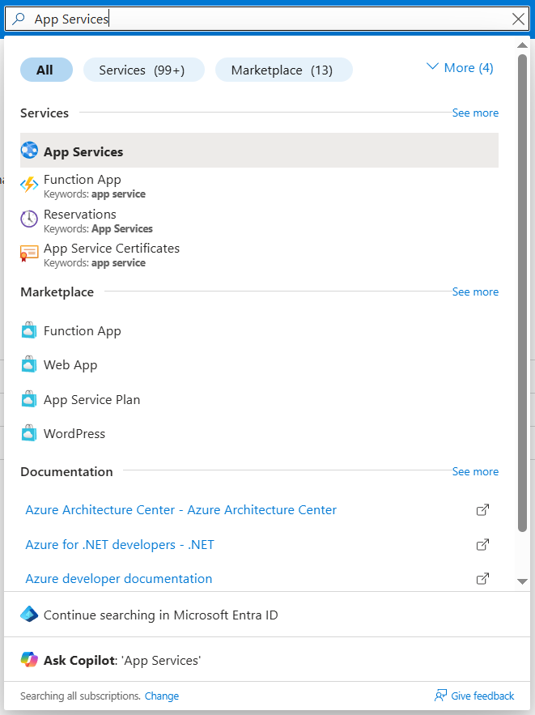
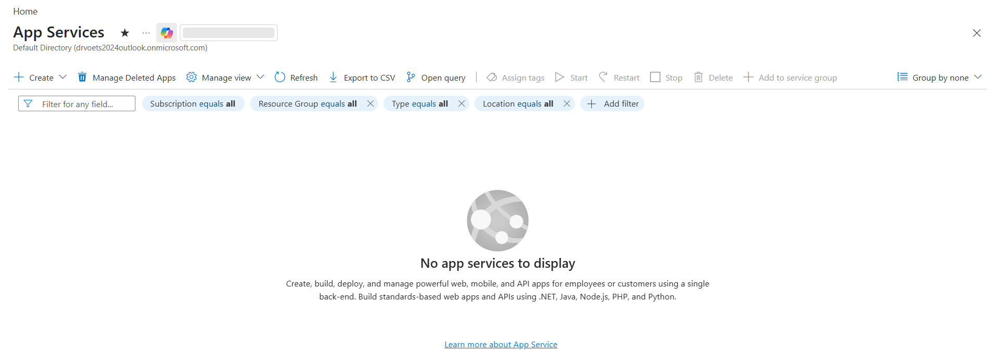

3. Seleccionamos **+ Crear** y, en el menú desplegable, elegimos **Web App**.
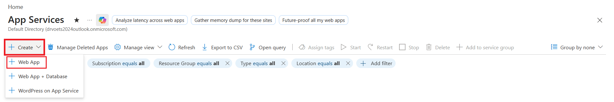

   > Observamos que existen otras opciones disponibles.

4. En la pestaña **Basics** de la hoja *Create Web App*, especificamos los siguientes valores (dejamos los demás con sus valores predeterminados):

   - **Subscription:** nuestra suscripción de Azure  
   - **Resource group:** `az104-rg9` (si es necesario, seleccionamos *Create new*)  
   - **Web app name:** cualquier nombre único a nivel global  
   - **Publish:** Code  
   - **Runtime stack:** PHP 8.2  
   - **Operating system:** Linux  
   - **Region:** East US  
   - **Pricing plan:** Premium V3 P1V3  
   - **Zone redundancy:** aceptamos los valores predeterminados
   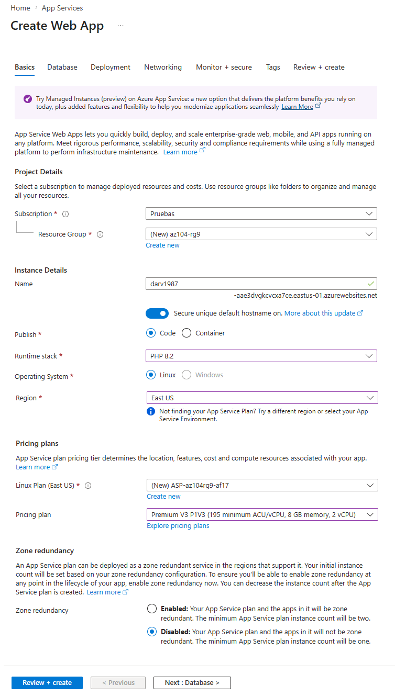

5. Seleccionamos **Review + create** y luego **Create**.  
    >
    > Esperamos a que la aplicación web se cree antes de continuar con la siguiente tarea (esto toma aproximadamente un minuto).
    >
    > **Nota:**
    >
    > Si el despliegue falla, cambiamos a otra región y lo intentamos nuevamente, ya que las cuotas pueden variar entre regiones.

6. El despliegue en nuestro caso falló, por lo que se cambió a la región de **Central US** como se demuestra en la siguientes imagesnes:

    En las siguientes imagenes que se adjuntan, se demuestran los errores que figuran si el despliegue falla por falta de cuota:

    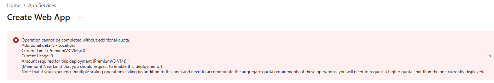
    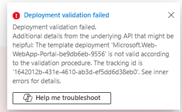
    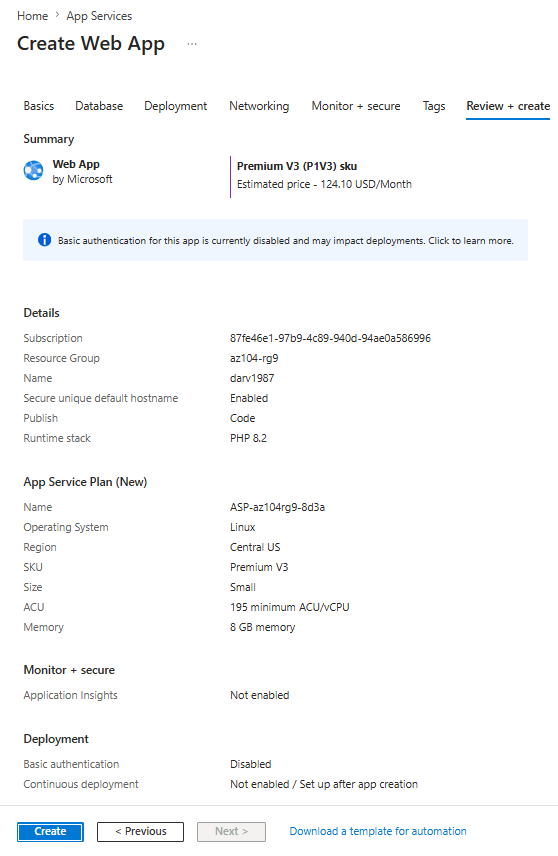

7. Una vez completado el despliegue, seleccionamos **Go to resource** para abrir la aplicación web recién creada.

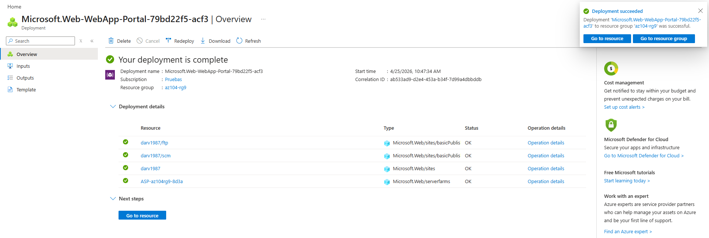

### Tarea 2: Crear y configurar un deployment slot

En esta tarea, creamos un *deployment slot* de **staging**. Los *deployment slots* nos permiten realizar pruebas antes de poner nuestra aplicación a disposición del público (o de nuestros usuarios finales). Una vez que hemos realizado las pruebas, podemos intercambiar el slot de desarrollo o staging con el de producción. Muchas organizaciones utilizan slots para pruebas previas a producción y, además, suelen ejecutar múltiples slots para cada aplicación (por ejemplo: desarrollo, QA, pruebas y producción).

1. En la hoja de la aplicación web recién desplegada, hacemos clic en el enlace **Default domain** para mostrar la página web predeterminada en una nueva pestaña del navegador.
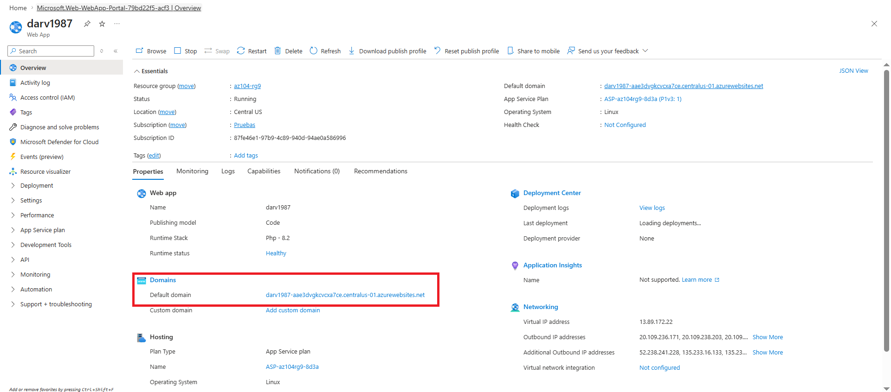
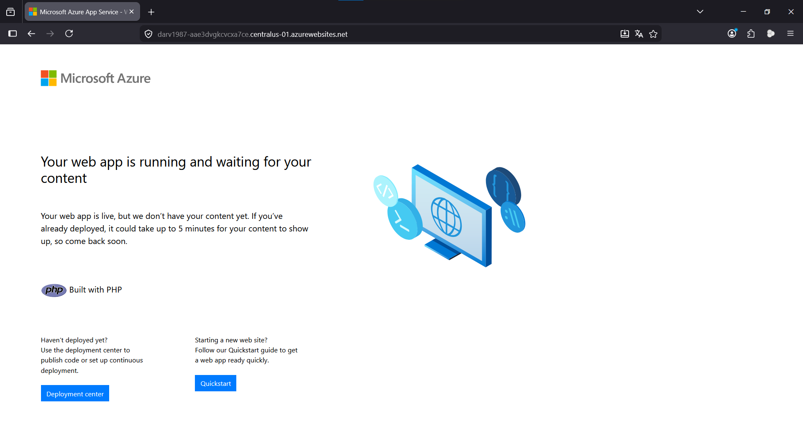

2. Cerramos la pestaña del navegador y, de vuelta en el portal de Azure, en la sección **Deployment** de la hoja de la aplicación web, hacemos clic en **Deployment slots**.
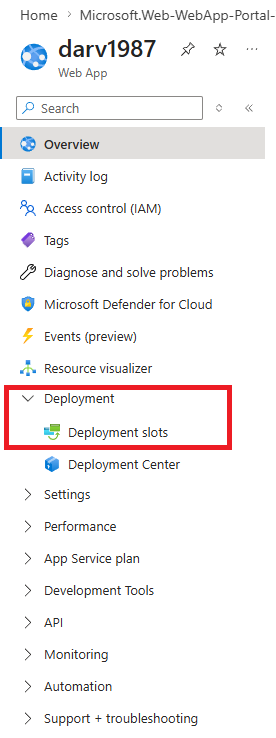

3. Seleccionamos **Add slot** y agregamos un nuevo slot con los siguientes valores:
    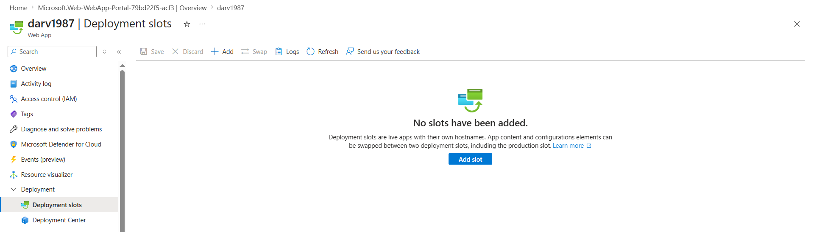

   - **Name:** staging  
   - **Clone settings from:** Do not clone settings  
   - Seleccionamos **Add** para crear el slot.
    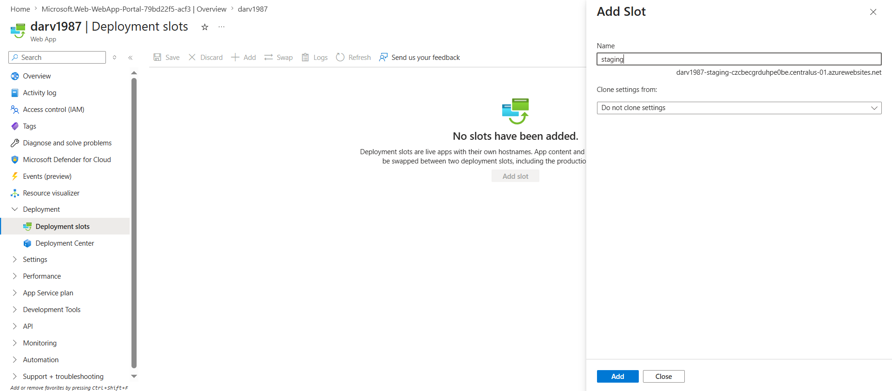

4. Actualizamos la página para visualizar los slots de **Production** y **Staging**.
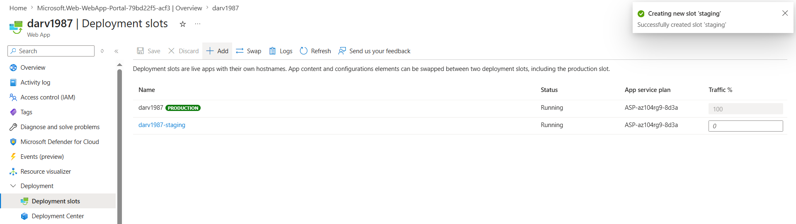

5. Seleccionamos la entrada que representa el slot de staging recién creado.  
   > Nota: Esto abrirá la hoja que muestra las propiedades del slot de staging.
   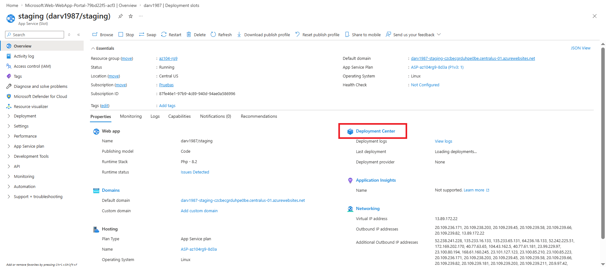

6. Revisamos la hoja del slot de staging y observamos que su URL difiere de la asignada al slot de producción.

### Tarea 3: Configurar Web App deployment settings

En esta tarea, configuramos los ajustes de despliegue de la aplicación web. Estos ajustes permiten habilitar el **despliegue continuo**, asegurando que el servicio de aplicaciones tenga siempre la versión más reciente de nuestra aplicación.

1. En el slot de **staging**, seleccionamos **Deployment Center** y luego **Settings**.
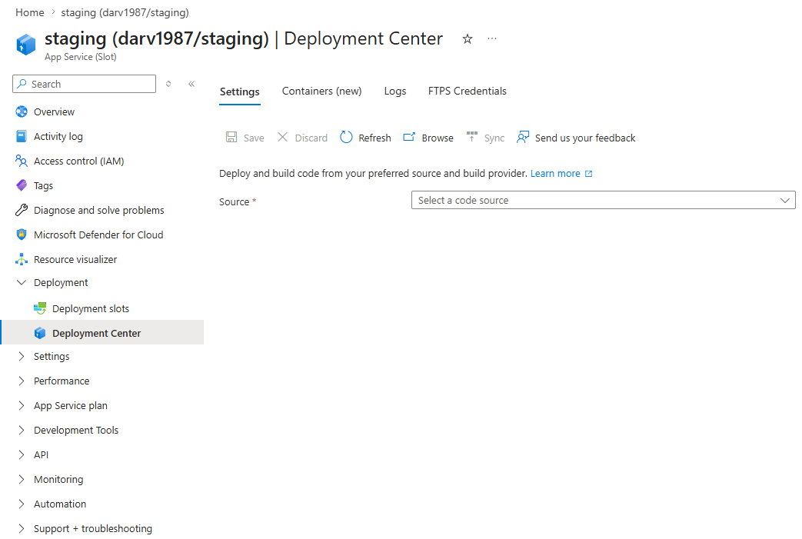

   > Nota: Nos aseguramos de estar en la hoja del slot de staging (y no en la de producción).
2. En la lista desplegable **Source**, seleccionamos **External Git**.
   > Observamos que existen otras opciones disponibles.
3. En el campo **Repository**, ingresamos:
   [https://github.com/Azure-Samples/php-docs-hello-world](https://github.com/Azure-Samples/php-docs-hello-world)
4. En el campo **Branch**, ingresamos:

   > master

5. Seleccionamos **Save** para guardar la configuración.
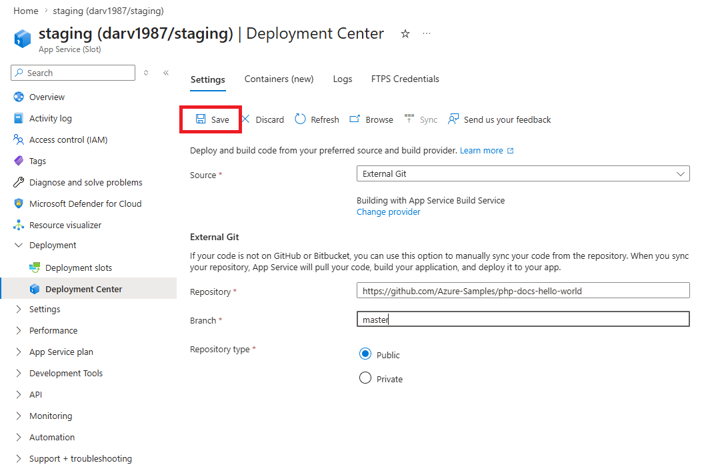

6. Desde el slot de staging, seleccionamos **Overview**.  
7. Hacemos clic en el enlace **Default domain** y abrimos la URL en una nueva pestaña del navegador.
8. Verificamos que el slot de staging muestre la página **Hello World**.
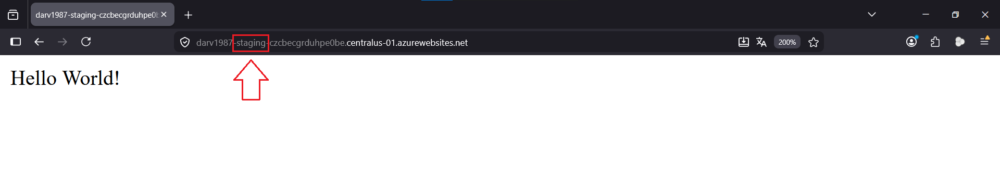

   > Nota: El despliegue puede tardar un minuto. Nos aseguramos de **refrescar la página** de la aplicación para visualizar el resultado.  

### Tarea 4: Swap deployment slots

En esta tarea, intercambiamos el slot de **staging** con el de **producción**. El intercambio de slots nos permite utilizar el código que hemos probado en el slot de staging y moverlo a producción. El portal de Azure también nos preguntará si necesitamos mover otras configuraciones de la aplicación que hayamos personalizado para el slot. El intercambio de slots es una tarea común para los equipos de aplicaciones y soporte, especialmente cuando se despliegan actualizaciones rutinarias o correcciones de errores.

1. Navegamos nuevamente a la hoja de **Deployment slots** y seleccionamos **Swap**.
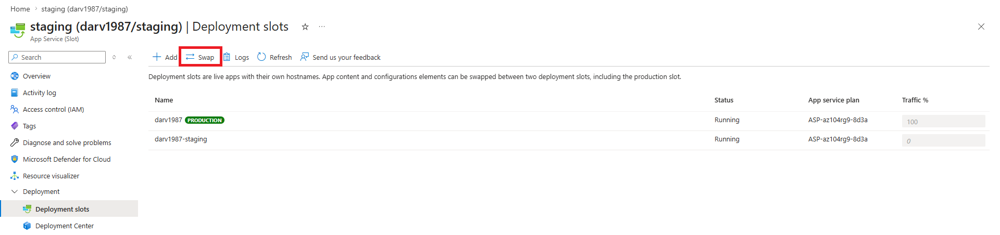

2. Revisamos la configuración predeterminada y hacemos clic en **Start Swap**.
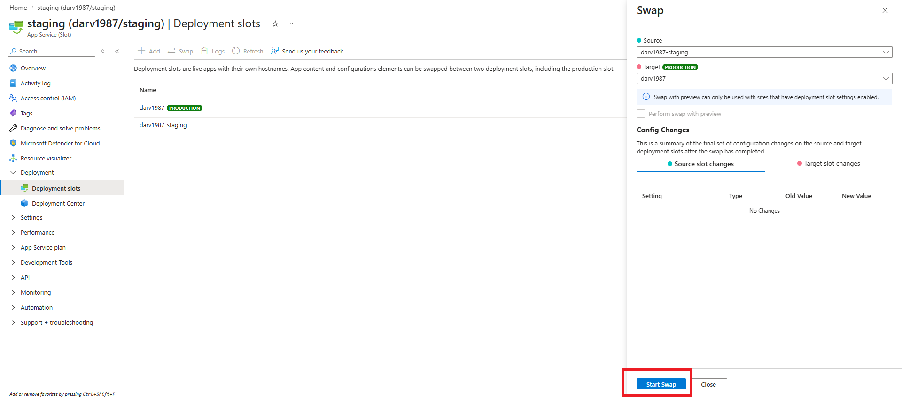

   > Esperamos la notificación que indica que el intercambio ha finalizado.
   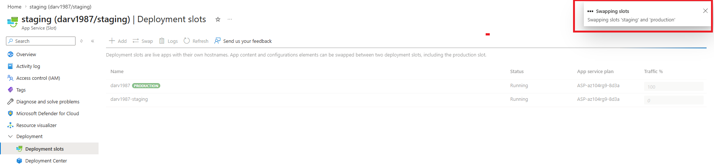
   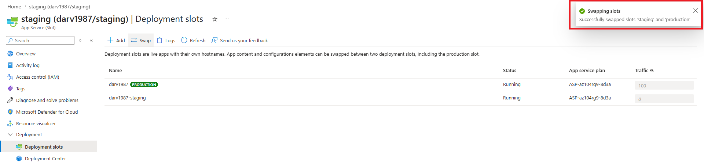

3. Regresamos a la página principal del portal. Ahora deberíamos ver tanto la aplicación web de producción como el slot de staging.
4. Buscamos **App Services** y seleccionamos nuestra aplicación web de App Service. Esto nos devuelve al slot de despliegue de producción.
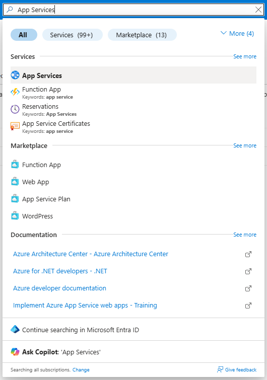
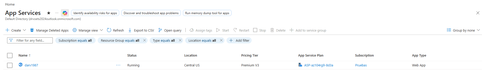

5. Seleccionamos la aplicación web de App Service y, en la hoja **Overview** de la aplicación, hacemos clic en el enlace **Default domain** para mostrar la página principal del sitio web.  
6. Verificamos que la página de producción ahora muestre el mensaje **Hello World!**.
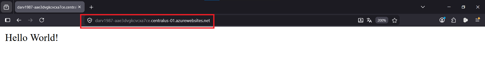

   > Nota: Copiamos la URL del **Default domain**, ya que la necesitaremos para la prueba de carga en la siguiente tarea.  

### Tarea 5: Configurar y probar autoscaling

En esta tarea, configuramos el **escalado automático (autoscaling)** de la aplicación web en Azure. El autoscaling nos permite mantener un rendimiento óptimo cuando el tráfico hacia la aplicación aumenta. Para determinar cuándo debe escalar la aplicación, podemos monitorear métricas como el uso de CPU, memoria o ancho de banda.

1. En el panel izquierdo, dentro de la sección **App Service plan**, seleccionamos **Scale out**.
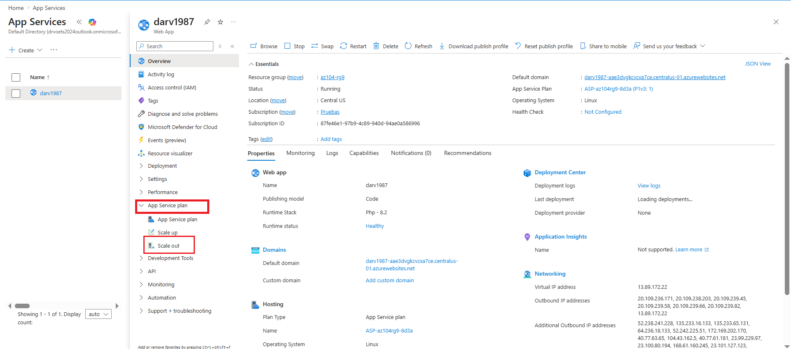

   > Nota: Nos aseguramos de estar trabajando en el slot de **producción**, no en el de staging.

2. En la sección **Scaling**, seleccionamos **Automatic**.
   > Observamos también la opción **Rules Based**, que permite configurar reglas basadas en métricas específicas de la aplicación.  
3. En el campo **Maximum burst**, seleccionamos **2**.  
4. Guardamos la configuración haciendo clic en **Save**.
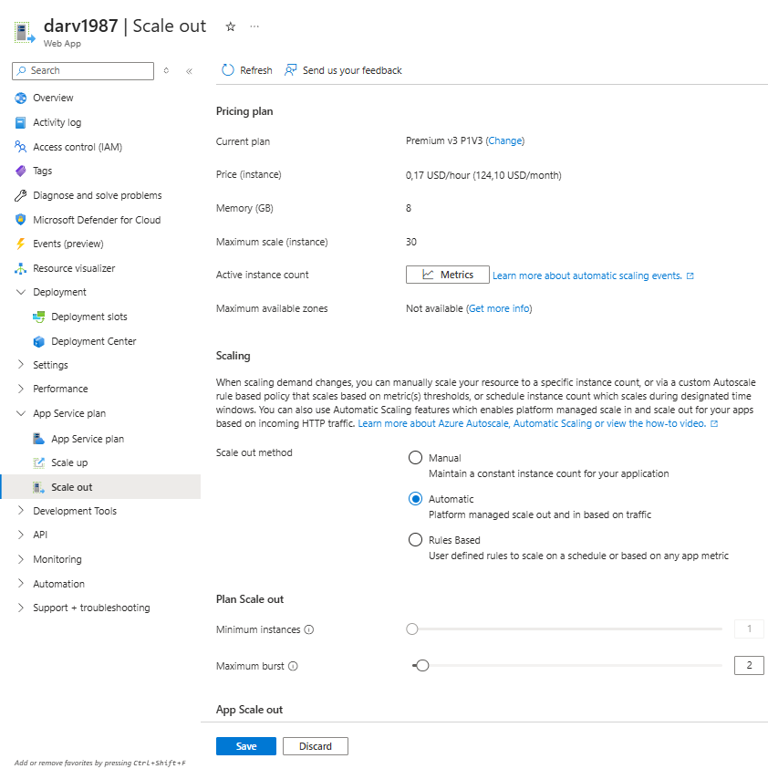

5. En el panel izquierdo de la página principal de la aplicación web, seleccionamos **Diagnose and solve problems**.
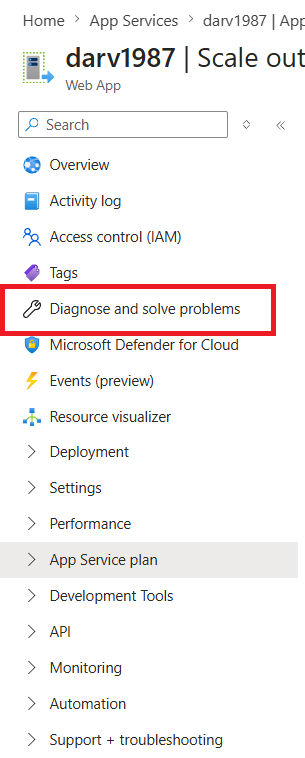

6. En el recuadro **Load Test your App**, seleccionamos **Create Load Test**.
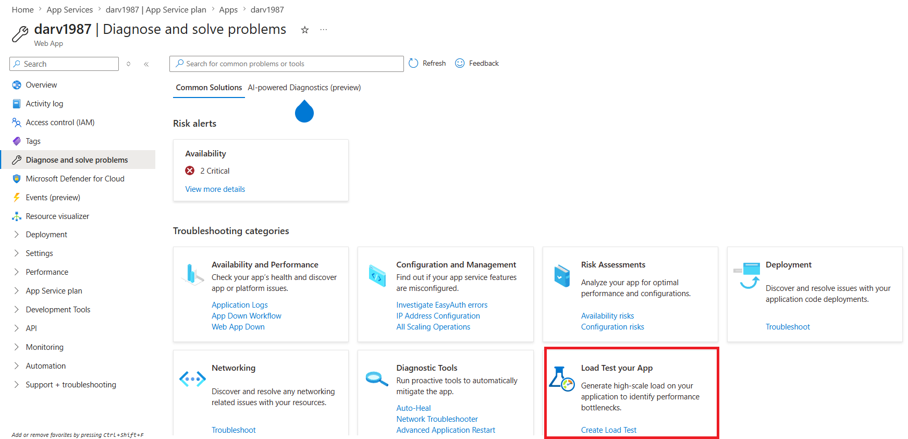

7. Hacemos clic en **+ Create** y asignamos un nombre único a la prueba de carga.
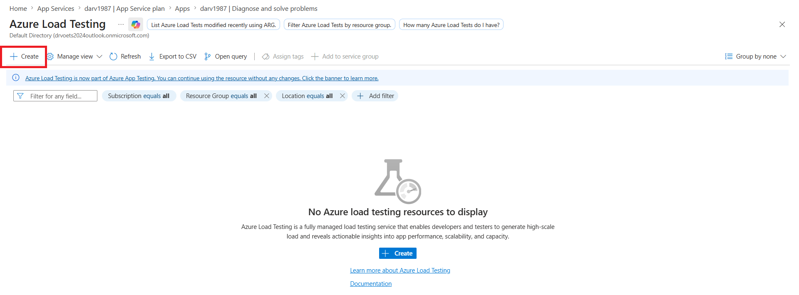

8. Seleccionamos **Review + create** y luego **Create**.
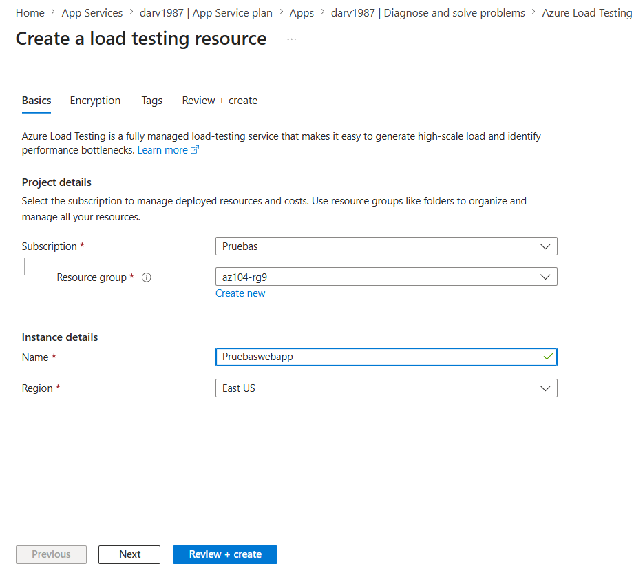

   > Esperamos a que la prueba de carga se cree y luego seleccionamos **Go to resource**.
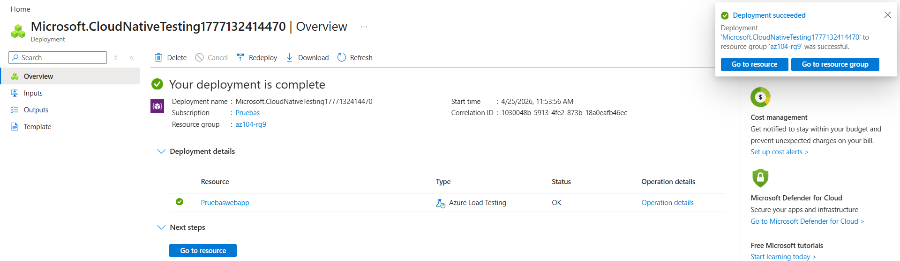

9. Desde la sección **Overview**, seleccionamos **Create** para añadir solicitudes HTTP.
    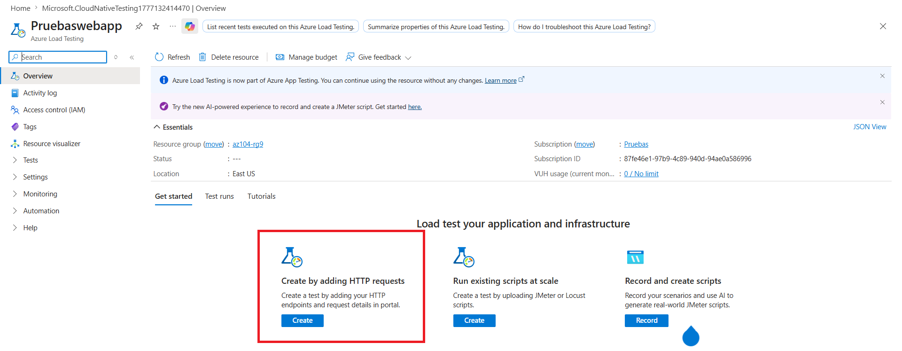

10. En la pestaña **Test plan**, hacemos clic en **Add request**.  
    - En el campo **URL**, pegamos la dirección del **Default domain** de nuestra aplicación.
    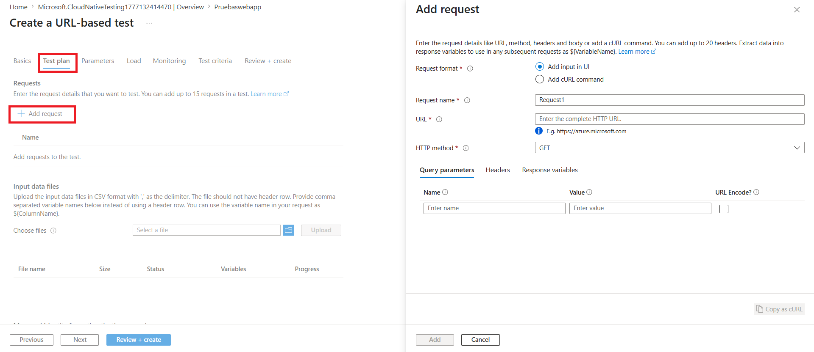

    - Nos aseguramos de que esté correctamente formateada y comience con `https://`.  
    - Seleccionamos **Add** para guardar los cambios.
    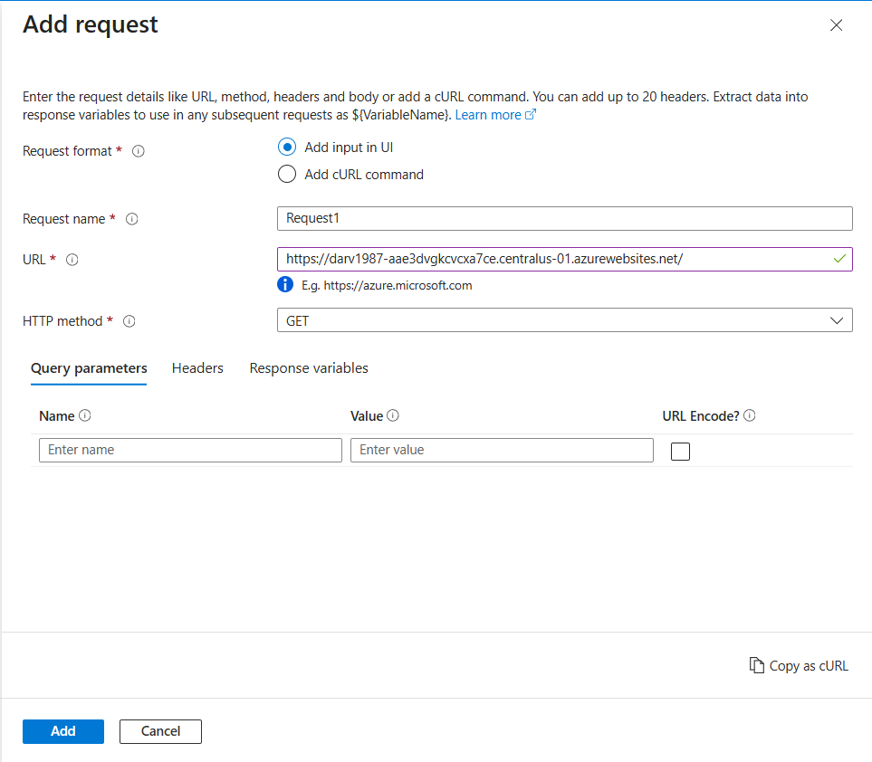

11. Seleccionamos **Review + create** y luego **Create** para iniciar la prueba.  
    > Nota: La creación de la prueba puede tardar un par de minutos. Revisamos las notificaciones.
    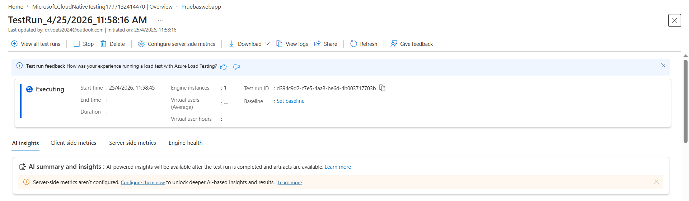

12. Navegamos hacia la prueba (aparece listada en la página principal).  
13. Actualizamos y revisamos las métricas en tiempo real, incluyendo:  
    - Usuarios virtuales  
    - Tiempo de respuesta  
    - Solicitudes por segundo
    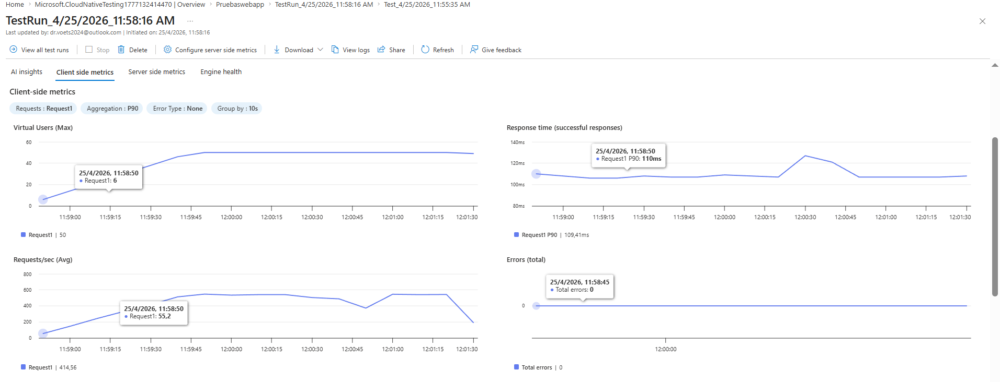
    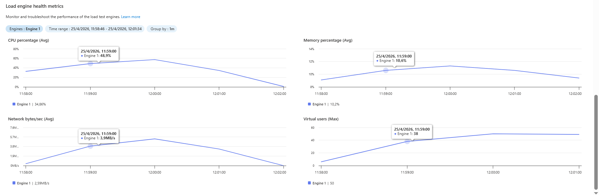

14. Seleccionamos **Stop** para finalizar la ejecución de la prueba.  
    > No es necesario esperar a que la prueba se complete por completo.  

---

## Conceptos reforzados

- **Azure App Services** como PaaS.  
- *Deployment slots* para pruebas y producción.  
- Continuous deployment desde GitHub.  
- Autoscaling para optimizar rendimiento.  

---

## Resultados esperados

- Aplicación web desplegada en Azure mostrando *Hello World*.  
- Slot de staging configurado y probado.  
- Swap exitoso entre staging y producción.  
- Autoscaling configurado y validado mediante prueba de carga.  

---

## Limpieza de recursos

Si estamos trabajando con nuestra propia suscripción, debemos tomar un momento para eliminar los recursos del laboratorio. Esto asegura que los recursos queden liberados y que los costos se minimicen.  
La forma más sencilla de eliminar los recursos del laboratorio es borrar el grupo de recursos.

1. En el **Azure portal**, seleccionamos el grupo de recursos, luego **Delete the resource group**, ingresamos el nombre del grupo de recursos y finalmente hacemos clic en **Delete**.
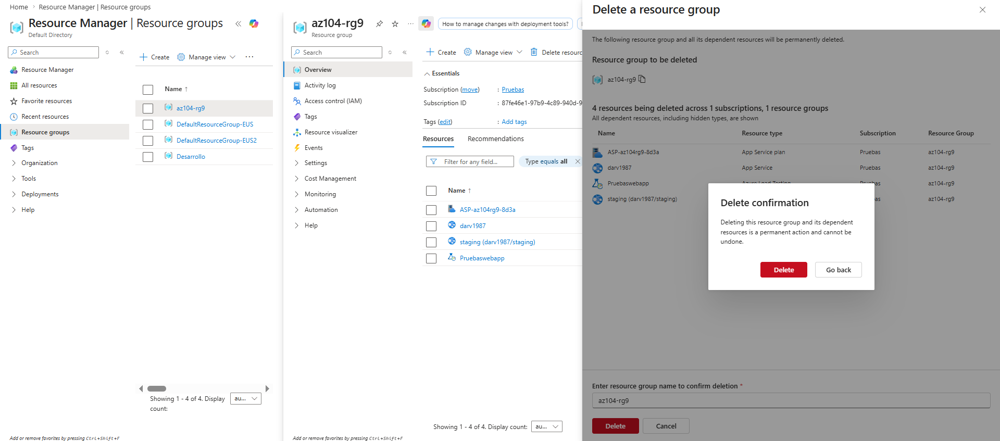

2. Usando **Azure PowerShell**:

   ```powershell
   Remove-AzResourceGroup -Name resourceGroupName
   ```  

3. Usando la **CLI de Azure**:  

   ```bash
   az group delete --name resourceGroupName
   ```

---

## Contribuciones

Este documento fue adaptado y traducido al español para fines de estudio del AZ-104. Se aceptan mejoras en la redacción, diagramas y ejemplos prácticos

---

## Licencia

Este laboratorio se distribuye bajo la licencia MIT. Puedes usarlo, modificarlo y compartirlo libremente, siempre citando la fuente original
